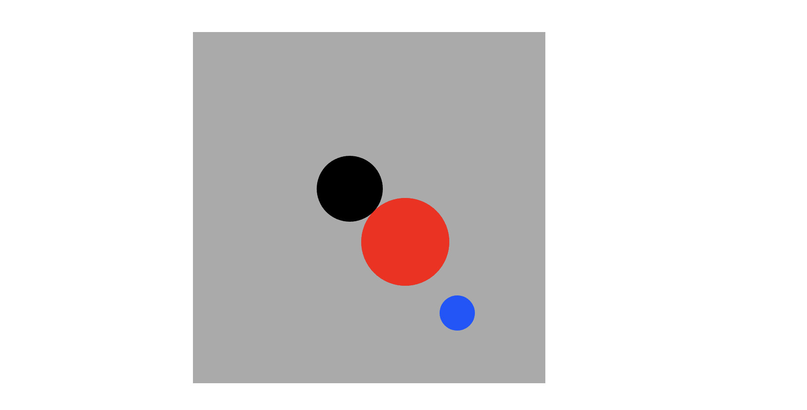

# TITLE OF PROJECT

Noureddine Mazzene

[View this project online](https://rocmazz.github.io/cart253/topics/conditionals-challenge/)

## Description

The User moves a puck to a target to make it change color

## Screenshot(s)

> 

## Attribution

> - This project uses [p5.js](https://p5js.org).
> - The clown image is a capture of the clown from the Apple emoji character set.
> - The barking sound effect is "single dog bark 1" by crazymonke9 from freesound.org: https://freesound.org/people/crazymonke9/sounds/418107/

## License

> This project is licensed under a Creative Commons Attribution ([CC BY 4.0](https://creativecommons.org/licenses/by/4.0/deed.en)) license with the exception of libraries and other components with their own licenses.