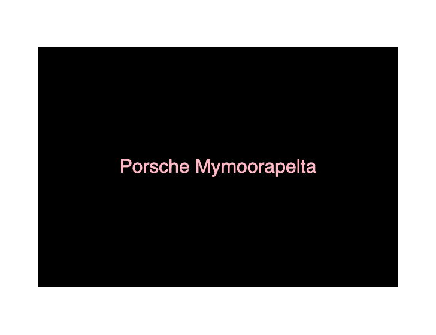

# Random Car Generator

Noureddine Mazzene

[View this project online](https://rocmazz.github.io/cart253/topics/data-challenge/)

## Description

Generates a car name with car brand and dinosaur name.

## Screenshot(s)

> 

## Attribution

> - This project uses [p5.js](https://p5js.org).
> - The Darius Kazemi’s corpora project data files [cars](https://github.com/dariusk/corpora/blob/master/data/corporations/cars.json) [dinosaurs](https://github.com/dariusk/corpora/blob/master/data/animals/dinosaurs.json).

## License

This project is licensed under a Creative Commons Attribution ([CC BY 4.0](https://creativecommons.org/licenses/by/4.0/deed.en)) license with the exception of libraries and other components with their own licenses.