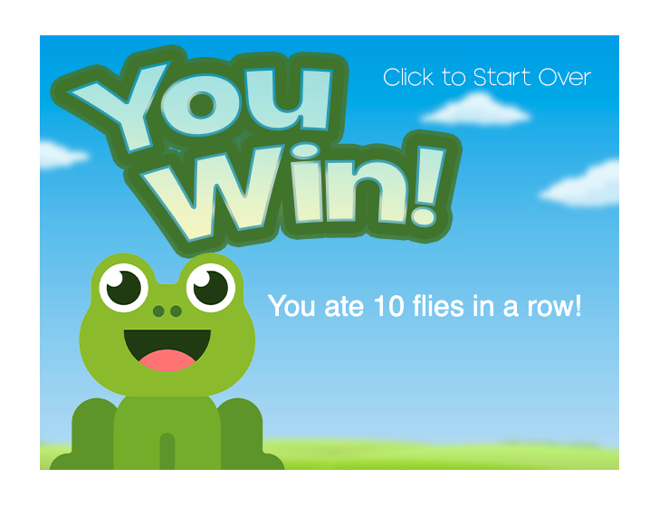

# Frog Game
Noureddine Mazzene

A game about catching flies.

[Play it!](https://rocmazz.github.io/cart253/topics/mod-jam/)

- [Ideas](./ideas.md)
- [Planning](./planning.md)
- [Pseudocode](./pseudocode.md)

## Description

Assignement 2:
Add and modify the orignial frogfrogfrog game

## Screenshot(s)

## Changes List
> - Game Structure 

Added a new “splash” screen that displays credits before the title screen (enables audio on first click).

Added a title screen, win screen, and game over screen as distinct game states.

Integrated state-based music (unique looping track for splash/title, gameplay, win, and lose screens).

Added click sound effect for transitions between screens.

> - Gameplay 

Added a win condition: eat 10 flies in a row without missing.

Added a lose condition: miss 3 flies.

Implemented a streak system to track consecutive catches.

Added a miss counter that increments when flies leave the screen.

> - Visual & Audio 

Added a splash image (credits page) and custom background image for the gameplay section.

Replaced default frog with custom frog sprites:

- Two in-game states: mouth closed and mouth open (changes dynamically with tongue state).

- Additional expressions for title, win, and lose screens.

Added fly movement variations:

- Straight (original)

- Sine-wave pattern

- Jitter/random vertical movement

Added UI rework for score display:

- Hunger bar fills progressively as streak increases (resets on miss).

- Miss indicators using X icons (tinted for potential misses, bright for actual misses).

Added sound effects:

- Click sound (game state transitions)

- Tongue sound (when extending)

- Catch sound (when a fly is caught)

- Miss sound (when a fly escapes)

## Attribution

> - This project uses [p5.js](https://p5js.org).
> - This project uses [SFX from Envato Elements](https://elements.envato.com/).
> - This project uses [Music from Lud and Schlatts Musical Emporium](https://www.youtube.com/@ludandschlattsmusicalempor6746).

## License

> This project is licensed under a Creative Commons Attribution ([CC BY 4.0](https://creativecommons.org/licenses/by/4.0/deed.en)) license with the exception of libraries and other components with their own licenses.