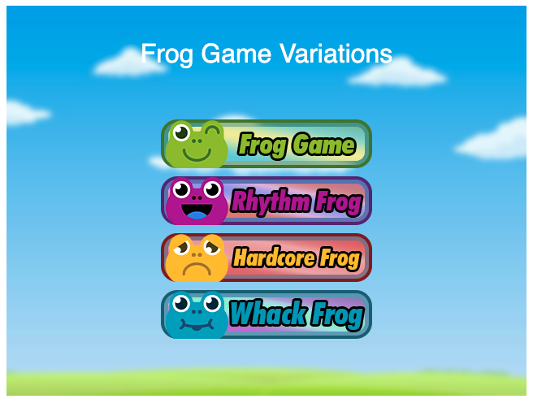
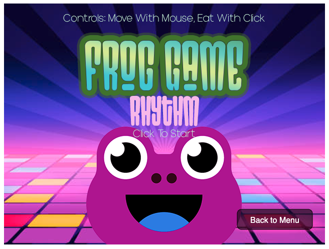
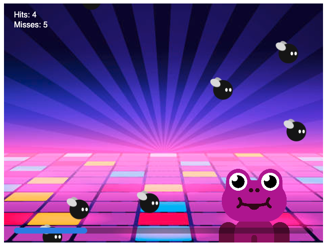
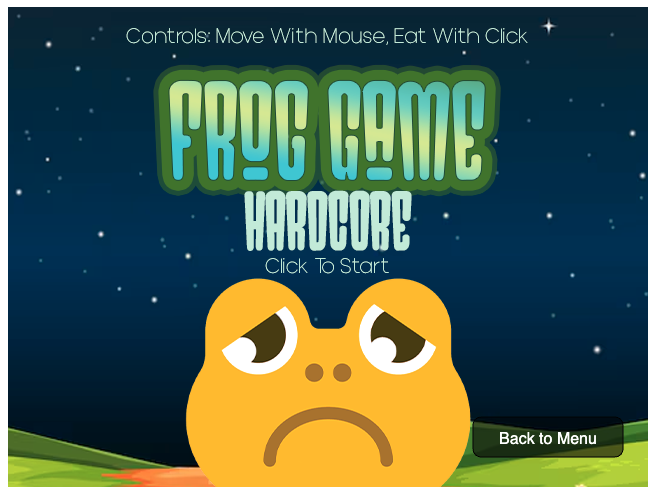
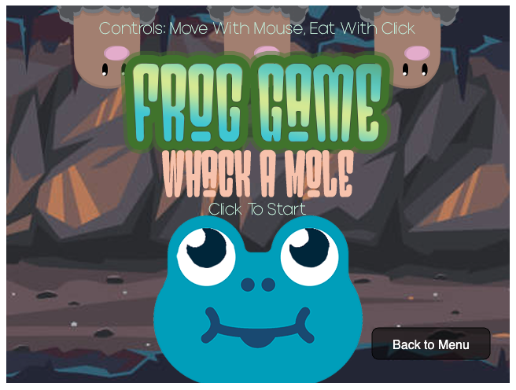

# Variation Jam (Frog Games)

Noureddine Mazzene

[View this project online](https://rocmazz.github.io/cart253/topics/variation-jam/)

## Description

## Screenshot(s)

## Changes List
> - Hardcore Frog

- Start, Win screen & Game Over Screen (game states)
- Win condition: Eat 10 flies in a row
- Lose condition: Miss 3 flies
- UI For score in game
- Adding music
- Changing Frog & Background in game
- Adding opening splash screen
- Adding SFX
- New Movement for flies
- Adding two states for the frog sprite 

> - Rhythm Frog

- Tied the gameplay to a fixed 119 BPM music track
- Removed lose conditions: the game always runs until the end of the song
- Replaced streak and lives with a pure score system based on how many flies you catch
- Made flies fall from the top of the screen at a fixed speed
- Spawned flies on a beat-based pattern so the game follows the rhythm of the track
- Randomized the horizontal position of falling flies so you have to move the frog with the mouse
- Increased tongue speed so it can keep up with the beat while still showing a visible animation
- Added a results screen that shows your final score and a rank (S / A / B / C) at the end of the song

> - Whack a Mole Frog

- Changing Frog & Background in game
- Replacing flies with Whack-A-Mole style targets
- Moles pop up from fixed holes instead of moving across screen
- Moles stay visible for a timed duration before hiding again
- Randomized mole durations for varied difficulty
- Missing a mole (timeout) now counts as a miss
- Removing previous left-to-right fly movement system
- Removing sine/jitter movement modes
- Keeping frog tongue mechanics from original
- Adding reset system for mole spawning
- Shoot-and-miss penalty

## Attribution

> - This project uses [p5.js](https://p5js.org).
> - This project uses [SFX from Envato Elements](https://elements.envato.com/).
> - This project uses [Music from Lud and Schlatts Musical Emporium](https://www.youtube.com/@ludandschlattsmusicalempor6746).

## License

> This project is licensed under a Creative Commons Attribution ([CC BY 4.0](https://creativecommons.org/licenses/by/4.0/deed.en)) license with the exception of libraries and other components with their own licenses.